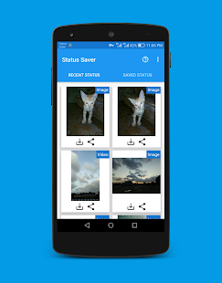
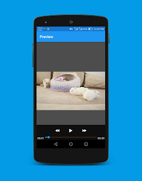
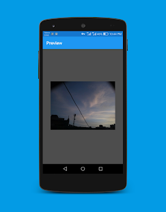

# WAStatusSaver
Status Saver for WhatsApp


## Screenshots




# Description
```
Now you can quickly save whatsapp status photo or video offline by downloading them with Status Saver for WA app. Status Saver for WA helps to download whatsapp status with absolute ease. Now install Status Saver for WA app and download the status in one click.  
  
App Features:  
✔️ View WhatsApp stories  
✔️ Save WhatsApp stories  
✔️ Full Screen Whatsapp Stories view  
✔️ Preview Downloaded Story  
✔️ Offers WhatsApp status download option  
✔️ Share with Friends  
✔️ Delete Unwanted Whatsapp Story  
  
How to Use:  
1. Select photo or video status you want to download  
2. Click on download button  
  
  
  
NOTE:  
Please do not use this app to save photo and video without respective owner permission. Respect the rights of the whatsapp user. We are constantly working hard on making the story saver repost for whatsapp app better and more useful for you. We need your constant support to get going. Please feel free to email us for any queries/suggestions/problems or if you just want to say hello. We would love to hear from you. If you enjoyed any feature of the Status Saver for Whatsapp app, do not forget to rate us on play store. Keep the app updated at all times for best experience, latest features and improvements.  
  
IMPORTANT:  
The "WhatsApp" name is copyright to WhatsApp, Inc. Status Saver for WA is in no way affiliated with, sponsored or endorsed by WhatsApp, Inc. If you notice that any content in our app violates copyrights than please inform us so that we remove that content.  
  
This app is an independent one and is not affiliated with any 3rd Party including Whatsapp inc. App not use to clone or hack anything it just lets you quickly save whatsapp status photo or video offline by downloading them
```


# License
```
MIT License

Copyright (c) 2020 Umair Ayub

Permission is hereby granted, free of charge, to any person obtaining a copy
of this software and associated documentation files (the "Software"), to deal
in the Software without restriction, including without limitation the rights
to use, copy, modify, merge, publish, distribute, sublicense, and/or sell
copies of the Software, and to permit persons to whom the Software is
furnished to do so, subject to the following conditions:

The above copyright notice and this permission notice shall be included in all
copies or substantial portions of the Software.

THE SOFTWARE IS PROVIDED "AS IS", WITHOUT WARRANTY OF ANY KIND, EXPRESS OR
IMPLIED, INCLUDING BUT NOT LIMITED TO THE WARRANTIES OF MERCHANTABILITY,
FITNESS FOR A PARTICULAR PURPOSE AND NONINFRINGEMENT. IN NO EVENT SHALL THE
AUTHORS OR COPYRIGHT HOLDERS BE LIABLE FOR ANY CLAIM, DAMAGES OR OTHER
LIABILITY, WHETHER IN AN ACTION OF CONTRACT, TORT OR OTHERWISE, ARISING FROM,
OUT OF OR IN CONNECTION WITH THE SOFTWARE OR THE USE OR OTHER DEALINGS IN THE
SOFTWARE.
```
